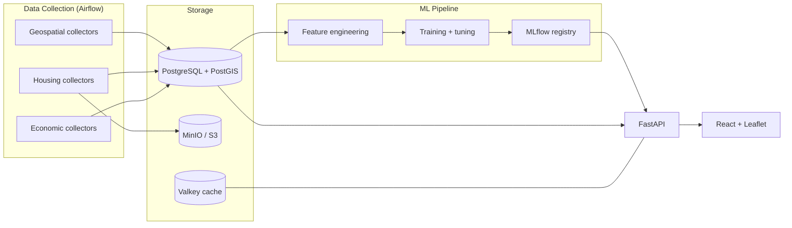

# PricePoint

[](https://github.com/nnayda/pricepoint/actions/workflows/ci.yml)
[](https://github.com/nnayda/pricepoint/actions/workflows/codeql.yml)
[](https://github.com/nnayda/pricepoint/releases)
[](LICENSE)

A residential home-search and valuation platform. Search any address and get a full property dashboard — crime, schools, points of interest, greenspace, climate risk, sale/tax history — plus an ML-driven home value prediction built from geospatial, housing, and economic data.

## Features

- **Home value prediction** — XGBoost models trained on a [94-feature engineered dataset](docs/FEATURE_CATALOG.md), tracked and versioned in MLflow with automated evaluation, validation, and promotion.
- **Property dashboard** — interactive Leaflet maps with crime heatmaps/incidents, assigned and nearby schools (with travel times), POIs, greenspace, and utility layers; mortgage calculator; sale & tax history charts.
- **Data pipeline** — 33 Airflow DAGs orchestrating collection → feature engineering → training across a medallion (bronze/silver/gold) architecture in PostGIS.
- **Broad data integration** — Redfin listing HTML, county assessments, TIGER/Line boundaries & roads, NCES school directory, Census ACS demographics, FRED economic indicators, Overture Maps places, HIFLD infrastructure, PAD-US public lands, police incident feeds, airport/rail noise, and more.
- **LLM-assisted quality scoring** — listing descriptions and photos scored via a local Ollama model to enrich training features.

## Architecture



## Tech Stack

| Layer          | Technologies                                                     |
|----------------|------------------------------------------------------------------|
| Backend        | Python 3.12, FastAPI, Uvicorn                                    |
| Database       | PostgreSQL + PostGIS, SQLAlchemy 2.0, GeoAlchemy2, Alembic       |
| Frontend       | React 18, TypeScript, Vite, Leaflet, Tailwind CSS                |
| ML             | XGBoost, MLflow (tracking + model registry)                      |
| Orchestration  | Apache Airflow (collection → features → training)                |
| Storage        | MinIO (S3-compatible), Valkey (Redis-compatible cache)           |
| Infra          | Docker Compose, Kubernetes/Helm, GitHub Actions                  |
| Dev Tools      | uv, Ruff, mypy, pytest, Vitest, ESLint/Prettier                  |

## Getting Started

Prerequisites: Docker + Docker Compose.

```sh
git clone https://github.com/nnayda/pricepoint.git
cd pricepoint
cp .env.example .env      # adjust as needed; free FRED/Census API keys optional
make up-all               # app + postgres/minio/valkey + bundled Airflow
```

Then open:

- Frontend: http://localhost:3000
- API docs: http://localhost:8000/docs
- MLflow: http://localhost:5001
- Airflow: http://localhost:8080

Other modes: `make up` (app only, external infra) and `make up-infra` (app + core infra, external Airflow).

## Development

```sh
uv sync --frozen          # backend dependencies
make lint                 # ruff check + format check
uv run mypy src/          # type checking
make test-unit            # backend unit tests
make migrate              # apply alembic migrations

make frontend-install     # npm install
cd frontend && npm run dev  # Vite dev server on :5173
make frontend-lint        # eslint + prettier
make frontend-test        # vitest
```

After editing backend code, `make dev-sync-api` pushes `src/` into the running API container in ~5s (no image rebuild). See [CONTRIBUTING.md](CONTRIBUTING.md) for the full workflow and commit conventions.

## Releases & Deployment

Versioning is automated with [release-please](https://github.com/googleapis/release-please): Conventional Commit titles on `main` accumulate into a release PR; merging it tags a release and publishes:

- **Container images** — `ghcr.io/nnayda/pricepoint/{api,frontend,mlflow,airflow}:<version>`
- **Helm chart** — `oci://ghcr.io/nnayda/pricepoint/charts/pricepoint`

Deploy to Kubernetes:

```sh
helm install pricepoint oci://ghcr.io/nnayda/pricepoint/charts/pricepoint --version <version>
```

The chart bundles optional PostgreSQL/PostGIS, MinIO, Valkey, and Airflow subcharts — see [`helm/pricepoint/values.yaml`](helm/pricepoint/values.yaml).

## Project Layout

```
src/pricepoint/
├── api/           # FastAPI routes, schemas, dependencies
├── config/        # Pydantic Settings (env-driven)
├── db/            # SQLAlchemy models, engine, Alembic migrations
├── data/          # Collectors (geospatial, housing, economic)
├── features/      # Feature engineering (assembly, geo, housing, econ)
└── models/        # ML training, tuning, evaluation, registry
frontend/src/      # React app (components, hooks, pages, services)
dags/              # Airflow DAGs
helm/pricepoint/   # Helm chart
docker/            # Service Dockerfiles
tests/             # unit/, integration/, docker/
docs/              # Feature catalog, DAG docs, deployment notes
```

## License

[MIT](LICENSE)
